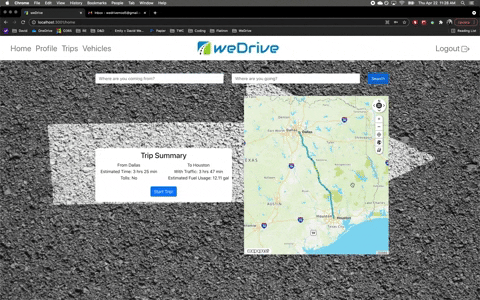
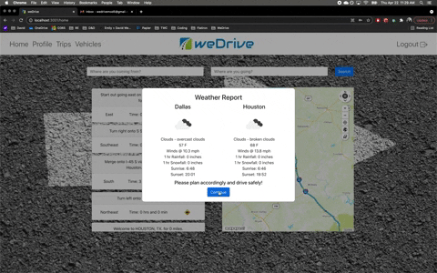
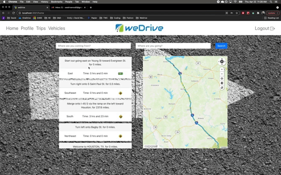

# README

This project was bootstrapped with [Create React App](https://github.com/facebook/create-react-app).

---
## weDrive - Frontend

weDrive is a journey management application that aims to reduce the risks associated with driving by providing the user with the information necessary to make smart driving decisions before they get in their car.

---
## Motivation

Driving is the most dangerous thing most people do on a daily basis but it's also something we take for granted and don't pay it the respect it deserves. weDrive was created to help encourage users to really think about the factors that impact their safety before they get in the car so they can plan accordingly and hopefully reduce the risk of an accident.

--- 
## Technology

* Frontend - React
* State Management - Redux
* Backend - Ruby on Rails
* MapQuest.js SKD
* OpenWeather API
* Styling - React Bootstrap

---
## Features

* OpenWeather API pulls current weather forecast for origin and destination of trip
* MapQuest map API utilized for step-by-step routing as well as real time traffic
* ActionMailer used to send notifications to Emergency Contacts
* JSON web tokens for authentication
* Bcrypt for password hashing on backend

---
## Demo

<a href="https://youtu.be/LWJn98YZfJY" target="_blank">Full Demo</a>

Starting a Trip:

Weather and Vehicle Inspection:

Routing and Emergency Contact Notification: 

---

## Available Scripts

In the project directory, you can run:

### `npm start`

Runs the app in the development mode.\
Open [http://localhost:3000](http://localhost:3000) to view it in the browser.

The page will reload if you make edits.\
You will also see any lint errors in the console.

### `npm test`

Launches the test runner in the interactive watch mode.\
See the section about [running tests](https://facebook.github.io/create-react-app/docs/running-tests) for more information.

### `npm run build`

Builds the app for production to the `build` folder.\
It correctly bundles React in production mode and optimizes the build for the best performance.

The build is minified and the filenames include the hashes.\
Your app is ready to be deployed!

See the section about [deployment](https://facebook.github.io/create-react-app/docs/deployment) for more information.

### `npm run eject`

**Note: this is a one-way operation. Once you `eject`, you can’t go back!**

If you aren’t satisfied with the build tool and configuration choices, you can `eject` at any time. This command will remove the single build dependency from your project.

Instead, it will copy all the configuration files and the transitive dependencies (webpack, Babel, ESLint, etc) right into your project so you have full control over them. All of the commands except `eject` will still work, but they will point to the copied scripts so you can tweak them. At this point you’re on your own.

You don’t have to ever use `eject`. The curated feature set is suitable for small and middle deployments, and you shouldn’t feel obligated to use this feature. However we understand that this tool wouldn’t be useful if you couldn’t customize it when you are ready for it.

